# 🏔️ Atlas Platform

> A personal project to build and operate a production-grade platform from scratch — starting with a REST API and progressively evolving toward a fully containerised, observable, and GitOps-driven system.

---

## 📋 Table of Contents

- [About](#about)
- [Architecture](#architecture)
- [Tech Stack](#tech-stack)
- [Project Roadmap](#project-roadmap)
- [Getting Started](#getting-started)
    - [Prerequisites](#prerequisites)
    - [Run Locally](#run-locally)
- [API Reference](#api-reference)
- [Environment Variables](#environment-variables)

---

## About

**Atlas Platform** is a hands-on platform engineering project built end-to-end from the ground up. The goal is to take a Go REST API from a developer's machine all the way to a production-ready, observable, and automatically deployed system — one milestone at a time.

Check the [Project Roadmap](#project-roadmap) to see where things currently stand.

---

## Architecture



---

## Tech Stack

| Layer | Technology |
|---|---|
| **Language** | Go |
| **Router** | [Chi](https://github.com/go-chi/chi) |
| **Database** | PostgreSQL |
| **Migrations** | [Goose](https://github.com/pressly/goose) |
| **Containerisation** | Docker *(upcoming)* |
| **CI Pipeline** | GitHub Actions *(upcoming)* |
| **Orchestration** | Kubernetes + Helm *(upcoming)* |
| **GitOps** | ArgoCD *(upcoming)* |
| **Observability** | Prometheus + Grafana *(upcoming)* |

---

## Project Roadmap

| # | Milestone | Status |
|---|---|---|
| 1 | Create a simple REST API Webserver | ✅ Done |
| 2 | Containerise REST API | ✅  Upcoming |
| 3 | Setup one-click local development setup | ⬜ Upcoming |
| 4 | Setup a CI pipeline | ⬜ Upcoming |
| 5 | Deploy on bare metal | ⬜ Upcoming |
| 6 | Setup Kubernetes cluster | ⬜ Upcoming |
| 7 | Deploy in Kubernetes | ⬜ Upcoming |
| 8 | Deploy using Helm Charts | ⬜ Upcoming |
| 9 | Setup GitOps with ArgoCD | ⬜ Upcoming |
| 10 | Setup observability stack | ⬜ Upcoming |
| 11 | Configure dashboards & alerts | ⬜ Upcoming |

---

## Getting Started

### Prerequisites

- [Go 1.22+](https://go.dev/dl/)
- [PostgreSQL](https://www.postgresql.org/download/)
- [Goose](https://github.com/pressly/goose) — for running migrations

### Run Locally

Clone the repository:

```bash
git clone https://github.com/<your-username>/atlas-platform.git
cd atlas-platform
```

Set up environment variables:

```bash
cp .env.example .env
# Edit .env with your local DB credentials and config
```

Install dependencies:

```bash
go mod tidy
```

Run database migrations:

```bash
goose -dir cmd/migrate/migrations postgres "$DB_ADDR" up
```

Start the API server:

```bash
go run ./cmd/api
```

The server will be available at `http://localhost:8080`.

Health check:

```bash
curl http://localhost:8080/health
# {"status":"ok"}
```

Run tests:

```bash
go test ./...
```

---

## API Reference

### Health

| Method | Endpoint | Description |
|---|---|---|
| `GET` | `/health` | Returns server health status |

**Response:**
```json
{
  "status": "ok"
}
```

> More endpoints will be documented here as the API grows.

---

## Environment Variables

| Variable | Default | Description |
|---|---|---|
| `PORT` | `8080` | Port the server listens on |
| `ENV` | `development` | Runtime environment (`development` / `production`) |
| `DB_HOST` | `localhost` | PostgreSQL host |
| `DB_PORT` | `5432` | PostgreSQL port |
| `DB_NAME` | — | Database name |
| `DB_USER` | — | Database user |
| `DB_PASSWORD` | — | Database password |

---

> **Note:** This is a personal project, built incrementally as a learning exercise in platform and reliability engineering. Every milestone adds a new layer to the system — follow along as it grows.
